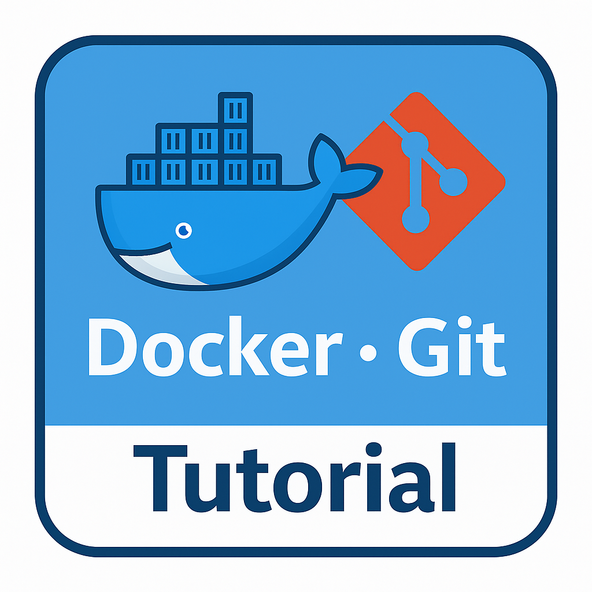
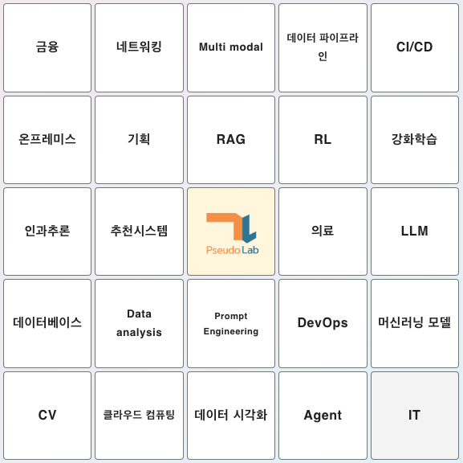
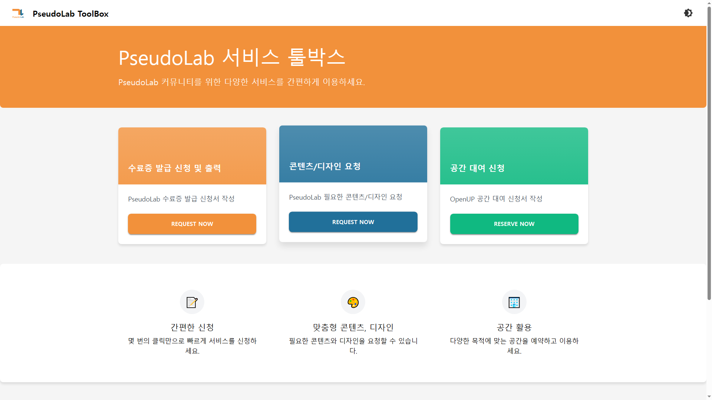

<h1 align="center"> DevFactory </h1>

  <a href="./README.en.md">[EN]</a> | <a href="./README.md">[KR]</a>

 

<!-- sheilds: https://shields.io/ -->

> Welcome to the DevFactory repository!
> We are building Pseudo-Lab’s developer culture through various tutorials and AI service development projects.
> 
> With empathy, communication, and collaboration at our core, we aim to create a culture where everyone can grow together.
> 
> Whether it’s joining a project or sharing a small idea, your contribution is always welcome.
> Feel free to reach out if you'd like to be part of the journey!

  
<b>Contact</b>

  - **GitHub Issues**: [Leave Feedback](https://github.com/Pseudo-Lab/DevFactory/issues)
  - **E-mail**: soohyun.dev@gmail.com — Builder: Soohyun Kim

## 🌟 Projects  
At DevFactory, we are shaping Pseudo-Lab’s unique developer ecosystem through the following activities :)

<h2>🌟 Projects</h2>

At DevFactory, we are shaping Pseudo-Lab’s unique developer ecosystem through the following activities :)

<table>
  <tr>
    <th align="center">🐳 Tutorial</th>
    <th align="center">🎮 Networking Event (BINGO)</th>
    <th align="center">📦 PseudoLab TOOLBOX</th>
  </tr>
  <tr>
    <td align="center" width="33%">
      We design and run a variety of technical tutorials. 
      From Docker and Git to LLMs, 
      we offer hands-on content and 
      offline workshops where everyone can learn and grow together.
    </td>
    <td align="center" width="33%">
      An open-source networking bingo web application, 
      freely available for anyone to use. 
      It helps spark natural conversations 
      through light, keyword-based topics.
    </td>
    <td align="center" width="33%">
      A <strong>support platform</strong> for participating in 
      and managing Pseudo-Lab activities. 
      This web service handles study applications, 
      certificate issuance, and more. <em>(In development)</em>
    </td>
  </tr>
  <tr>
    <td align="center">
      <a href="https://pseudo-lab.github.io/DevFactory/intro.html">
         
        View tutorial
      </a>
    </td>
    <td align="center">
      <a href="https://github.com/Pseudo-Lab/event-bingo">
         
        View on GitHub
      </a>
    </td>
    <td align="center">
      <a href="https://www.pseudolab-devfactory.com/">
         
        Visit site
      </a>
    </td>
  </tr>
</table>

## 🧑 팀원 소개

<table>
  <tr>
    <td align="center" width="300px">
        
      <b>Soohyun Kim</b> 
      <b>PM / Infra</b> 
      <b>Major Experience</b>: HDC Labs, AI Engineer 
       
       
      
      
       
      🔗 <a href="https://github.com/soohyunme">Github</a> | 
      <a href="https://velog.io/@kimsoohyun/posts">Blog</a> | 
      <a href="https://www.linkedin.com/in/soohyun-dev">LinkedIn</a> | 
      <a href="https://search.shopping.naver.com/book/catalog/49530069623?query=%EB%94%B0%EB%9D%BC%ED%95%98%EB%A9%B0%20%EB%B0%B0%EC%9A%B0%EB%8A%94%20mlops%20dev&NaPm=ct%3Dmar57pjk%7Cci%3D07926149f717a4c875317607826c173195ccd48a%7Ctr%3Dboksl%7Csn%3D95694%7Chk%3D6e7ef43a91e627efa7a5800b657df37b8ce0db4d">Book</a>
    </td>
    <td align="center" width="300px">
        
      <b>Yesin Kim</b> 
      <b>Backend / DB</b> 
      <b>Major Experience</b>: AI Talk, NLP Engineer 
       
             
       
      🔗 <a href="https://github.com/yesinkim">Github</a> |
      <a href="https://velog.io/@bailando/posts">Blog</a> | 
      <a href="https://www.linkedin.com/in/bailando">LinkedIn</a>
    </td>
    <td align="center" width="300px">
        
      <b>Seungkyu Kim</b> 
      Frontend 
      <b>Major Experience</b>: Imagoworks , Data Engineer 
      
       
       
      🔗 <a href="https://github.com/ed-kyu">Github</a> |
      <a href="https://www.linkedin.com/in/seungkyu-kim-9088a21b1/">LinkedIn</a>
    </td>
  </tr>
</table>

## 🛠️ Tech Stack
| Category                | Tools & Technologies | 
| ----------------------- | --------- |
| Programming Language    | JavaScript, Python |
| Frontend                | React | 
| Backend                 | FastAPI | 
| Database                | PostgreSQL, Notion  | 
| Version Control         | Github  | 
| Cloud Services          | Oracle  | 
| Deployment Tools        | Docker  | 
| DevOps                  | Github Actions | 
| Automation/Integration  | Make |
| Collaboration Tools     | Discord, Notion | 

## Acknowledgement  🙏
DevFactory is a development group within Pseudo-Lab, operating as part of its Open Research Initiative. 
Special thanks to our contributors and the open-source community for their valuable insights and contributions.

## About Pseudo Lab 👋🏼

[Pseudo-Lab](https://pseudo-lab.com/) is a non-profit organization focused on advancing machine learning and AI technologies. Our core values of Sharing, Motivation, and Collaborative Joy drive us to create impactful open-source projects. With over 5k+ researchers, we are committed to advancing machine learning and AI technologies.

<h2>Contributors 😃</h2>

  

<h2>License 🗞</h2>

This project is licensed under the [MIT License](https://opensource.org/licenses/MIT).
