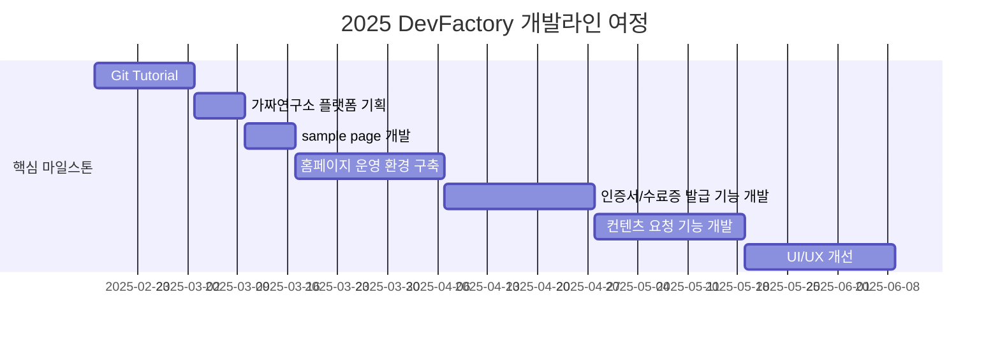

# DevFactory

<h1 align="center"> DevFactory </h1>

<div align="center">
<a href="https://pseudo-lab.com"></a>
<a href="https://discord.gg/EPurkHVtp2"></a>
<a href="https://github.com/Pseudo-Lab/DevFactory/stargazers"></a>
<a href="https://github.com/Pseudo-Lab/DevFactory/network/members"></a>
<a href="https://github.com/Pseudo-Lab/DevFactory/pulls"></a>
<a href="https://github.com/Pseudo-Lab/DevFactory/issues"></a>
<a href="https://github.com/Pseudo-Lab/DevFactory/graphs/contributors"></a>
<a href="https://hits.seeyoufarm.com"></a>
</div>
<br>

<!-- sheilds: https://shields.io/ -->
<!-- hits badge: https://hits.seeyoufarm.com/ -->

> Welcome to the DevFactory repository! We aim to build a unique development culture at Pseudo-Lab by conducting hands-on Git and Docker tutorials. Additionally, we are developing a certificate issuance platform for Pseudo-Lab. Join us in shaping the development culture at Pseudo-Lab through open collaboration and innovation!

## 🌟 프로젝트 목표 (Project Vision)
_"가짜연구소의 개발 문화를 만들어가는 DevFactory"_  
- 신규 러너들의 Git 사용을 위한 Git Tutorial
- 가짜연구소 수료증 발급 시스템 개발
- 가짜연구소 개발 문화를 위해 꾸준히 노력하기


## 🧑 역동적인 팀 소개 (Dynamic Team)

| 역할          | 이름 |  기술 스택 배지                                                                 | 주요 관심 분야                          |
|---------------|------|-----------------------------------------------------------------------|----------------------------------------|
| **기획** | 김수현 |      | CI/CD, MLOps 파이프라인 설계             |
| **기획** | 김예신 |   | 데이터 파이프라인 설계                  |


## 🚀 프로젝트 로드맵 (Project Roadmap)



## 🛠️ 우리의 개발 문화 (Our Development Culture)
**우리의 개발 문화**  
```python
class CollaborationFramework:
    def __init__(self):
        self.tools = {
            'communication': 'Discord',
            'version_control': 'GitHub Projects',
            'ci/cd': 'GitHub Actions',
            'docs': 'Github Wiki'
        }
    
    def workflow(self):
        return """주간 사이클:
        1️⃣ 수요일: 개발 사항 공유 및 코드 리뷰 세션(Live Share)
```


## 📈 성과 지표 (Achievement Metrics)
**2025 주요 KPI**  
| 지표                     | 목표치 | 현재 달성률 |
|--------------------------|--------|-------------|
| 튜토리얼 및 데모 제작 수                  | 3개  | 0%         |
| 커밋 수              | 400    | 1%         | 
| 플랫폼 방문수          | 200회    | 0회         |


## 💻 주차별 활동 (Activity History)

| 날짜 | 내용 | 발표자 | 
| -------- | -------- | ---- |
| 2025/02/19 | Github Tutorial 기획 및 문서 작성 | DevFactory |
| 2025/02/26 | Github Tutorial 최종 수정 및 배포| DevFactory | 
| 2025/03/05 | 가짜연구소 플랫폼 기획 | DevFactory | 
| 2025/03/12 | Sample page 개발 | DevFactory | 
| 2025/03/19 | 운영 환경 구축 및 코드 컨벤션 논의 | DevFactory | 
| 2025/03/26 | 코드 컨벤션 문서 작성 or 적용 | DevFactory | 
| 2025/04/02 | 인증서/수료증 발급 기능 개발 Part 1. | DevFactory | 
| 2025/04/09 | 인증서/수료증 발급 기능 개발 Part 2. | DevFactory | 
| 2025/04/16 | 컨텐츠 요청 기능 개발 Part 1. | DevFactory | 
| 2025/04/23 | 컨텐츠 요청 기능 개발 Part 2. | DevFactory | 
| 2025/04/30 | PseudoCon 프로젝트 기획 및 개발 착수 | DevFactory | 
| 2025/05/07 | PseudoCon 프로젝트 내부 테스트 진행 | - | 
| 2025/05/14 | PseudoCon 프로젝트 개발 완료 및 테스트 | DevFactory | 
| 2025/05/21 | PseudoCon 프로젝트 회고 | DevFactory | 
| 2025/05/28 | 가짜연구소 플랫폼 UI/UX 개선 Part 1. | DevFactory | 
| 2025/06/04 | 가짜연구소 플랫폼 UI/UX 개선 Part 2. | DevFactory | 
| 2025/06/11 | DevFactory 마무리 회식 | DevFactory | 


## 💡 학습 자원 (Learning Resources)
**우리가 만든 지식 허브**  
- 준비중


## 🌱 참여 안내 (How to Engage)
**팀원으로 참여하시려면 팀 빌더(김수현, 김예신)에게 DM 주세요.**  

**누구나 프로젝트에 참여하실 수 있습니다.**  
1. 기존 문서를 참조하여 히스토리 파악
2. DevFactory 팀 빌더(김수현, 김예신)애게 참여희망 DM 전송
3. Magical Week 중 행사에 참가
4. Pseudo Lab 행사에서 만나기

## Acknowledgement 🙏

DevFactory is developed as part of Pseudo-Lab's Open Research Initiative. Special thanks to our contributors and the open source community for their valuable insights and contributions.

## About Pseudo Lab 👋🏼</h2>

[Pseudo-Lab](https://pseudo-lab.com/) is a non-profit organization focused on advancing machine learning and AI technologies. Our core values of Sharing, Motivation, and Collaborative Joy drive us to create impactful open-source projects. With over 5k+ researchers, we are committed to advancing machine learning and AI technologies.

<h2>Contributors 😃</h2>
<a href="https://github.com/Pseudo-Lab/DevFactory/graphs/contributors">
  
</a>
<br><br>

<h2>License 🗞</h2>

This project is licensed under the [MIT License](https://opensource.org/licenses/MIT).
