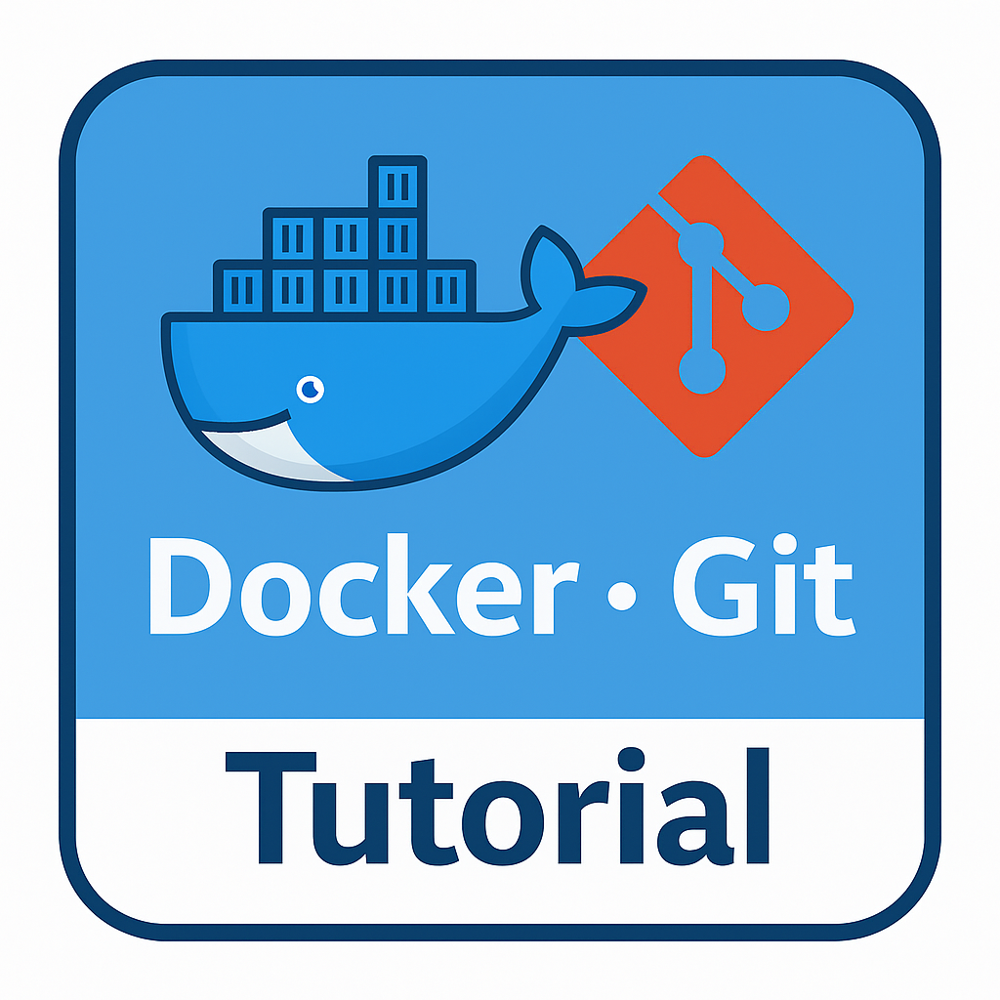

<h1 align="center"> DevFactory </h1>

  <a href="./README.en.md">[EN]</a> | <a href="./README.md">[KR]</a>

 

<!-- sheilds: https://shields.io/ -->

> DevFactory 리포지토리에 오신 것을 환영합니다!  
> 우리는 다양한 튜토리얼과 AI 서비스 개발 프로젝트를 통해 가짜연구소의 개발 문화를 함께 만들어가고 있습니다.  
> 배려와 소통, 협업을 바탕으로 모두가 성장하는 개발 문화를 만들어갑니다.  
> 프로젝트에 대한 아이디어나 의견은 언제든 환영하니, 편하게 연락 주세요!

  
<b>Contact</b>

  - **GitHub Issues**: [의견 남기기](https://github.com/Pseudo-Lab/DevFactory/issues)
  - **E-mail**: soohyun.dev@gmail.com — Builder: 김수현

## 🌟 프로젝트  
DevFactory에서는 아래와 같은 활동을 통해 가짜연구소만의 개발 생태계를 만들어가는 중입니다 🤗

### 🐳 Tutorial

 

다양한 기술 튜토리얼을 기획·운영합니다.
Docker, Git, LLM 등 실습 중심의 콘텐츠와 오프라인 워크숍을 통해 함께 배우고 성장합니다.

 

### 🎮 네트워킹 이벤트 (BINGO)

 

누구나 자유롭게 사용할 수 있도록 오픈소스로 공개한 네트워킹 빙고 웹 애플리케이션입니다.
키워드 기반의 빙고 게임을 통해 가벼운 대화를 유도하고 네트워킹을 돕습니다.

 

### 📜 수료증 발급 시스템

 

가짜연구소 <strong>수료증 발급 시스템</strong>입니다. 
가짜연구소 활동에 대한 수료증을 발급받을 수 있는 웹 서비스입니다.

### 🔎 기수별 활동

- [DevFactory 10기 활동 페이지](docs/10th_plan.md)

## 🧑 팀원 소개

<table>
  <tr>
    <td align="center" width="300px">
        
      <b>김수현</b> 
      <b>PM / Infra</b> 
      <b>주요경력</b>: HDC 랩스, AI Engineer 
       
       
      
      
       
      🔗 <a href="https://github.com/soohyunme">Github</a> | 
      <a href="https://velog.io/@kimsoohyun/posts">Blog</a> | 
      <a href="https://www.linkedin.com/in/soohyun-dev">LinkedIn</a> | 
      <a href="https://search.shopping.naver.com/book/catalog/49530069623">Book</a>
    </td>
    <td align="center" width="300px">
        
      <b>김예신</b> 
      <b>Backend / DB</b> 
      <b>주요경력</b>: 에이아이톡, NLP Engineer 
       
             
       
      🔗 <a href="https://github.com/yesinkim">Github</a> |
      <a href="https://velog.io/@bailando/posts">Blog</a> | 
      <a href="https://www.linkedin.com/in/bailando">LinkedIn</a>
    </td>
    <td align="center" width="300px">
        
      <b>김승규</b> 
      <b>Frontend</b> 
      <b>주요경력</b>: 이마고웍스, Data Engineer 
      
       
       
      🔗 <a href="https://github.com/ed-kyu">Github</a> |
      <a href="https://www.linkedin.com/in/seungkyu-kim-9088a21b1/">LinkedIn</a>
    </td>
  </tr>
</table>

## 🛠️ 기술 스택
| 분류                    | 사용 기술 | 
| ----------------------- | --------- |
| Programming Language    | JavaScript, Python |
| Frontend                | React | 
| Backend                 | FastAPI | 
| Database                | PostgreSQL, Notion  | 
| Version Control         | Github  | 
| Cloud Services          | Oracle  | 
| Deployment Tools        | Docker  | 
| DevOps                  | Github Actions | 
| Automation/Integration  | Make |
| Collaboration Tools     | Discord, Notion | 

## 감사의 말씀 🙏
DevFactory는 가짜연구소 소속의 개발 조직으로, Open Research Initiative의 일환으로 운영되고 있습니다.  
소중한 인사이트와 기여를 보내주신 모든 기여자분들과 오픈소스 커뮤니티에 깊이 감사드립니다.

## 가짜연구소 소개 👋🏼

[가짜연구소](https://pseudo-lab.com/)는 머신러닝과 인공지능 기술의 발전을 목표로 하는 비영리 단체입니다. 
<b>공유(Sharing), 동기부여(Motivation), 협업의 즐거움(Collaborative Joy)</b>이라는 핵심 가치를 바탕으로 의미 있는 오픈소스 프로젝트를 함께 만들어가고 있으며, 5천 명이 넘는 연구자들과 함께 머신러닝과 AI 분야의 발전에 기여하고 있습니다.

<h2>Contributors 😃</h2>

  

<h2>License 🗞</h2>

This project is licensed under the [MIT License](https://opensource.org/licenses/MIT).
