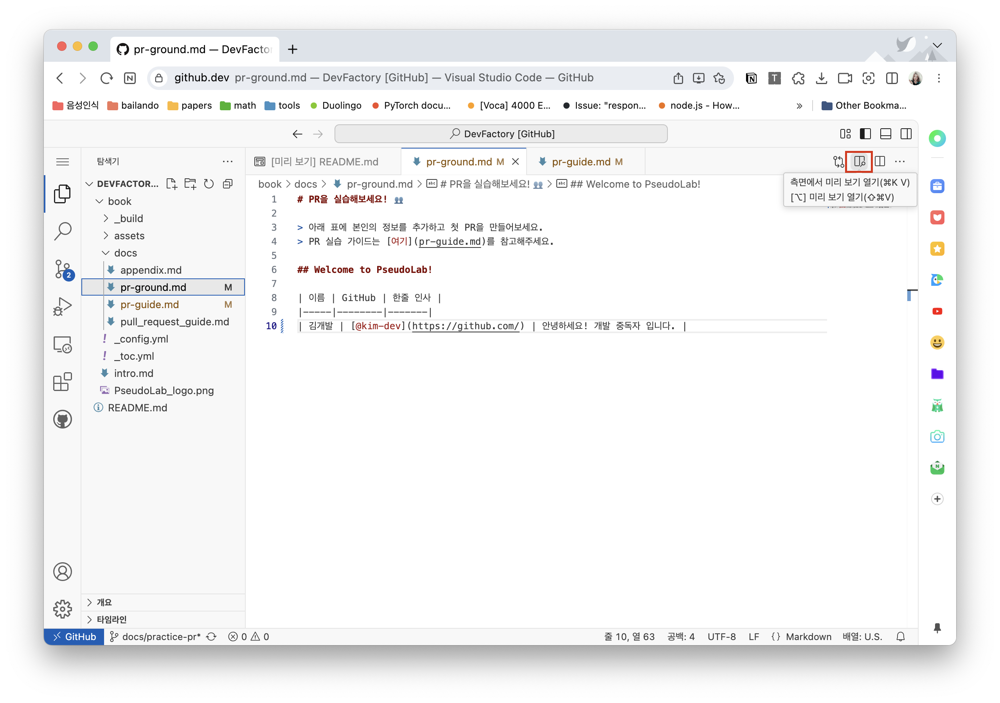
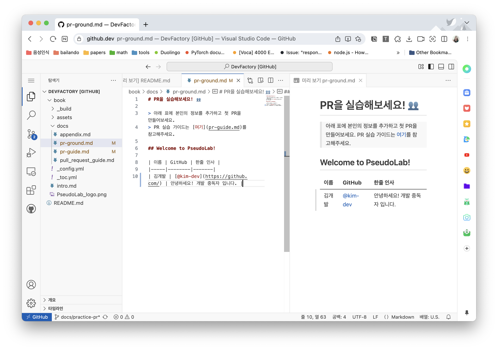
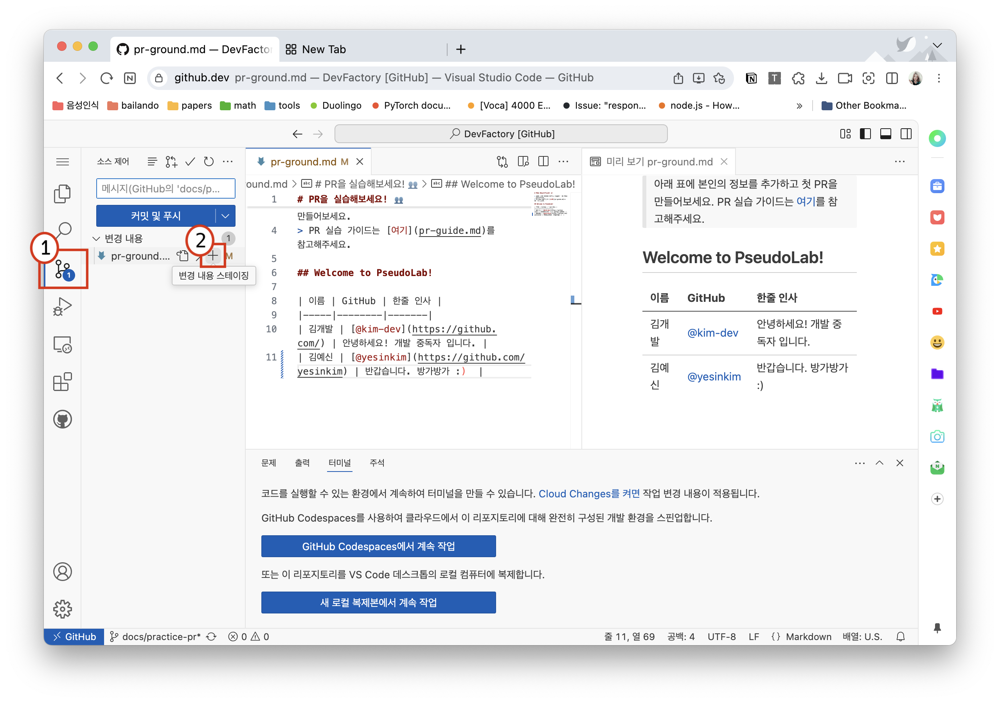
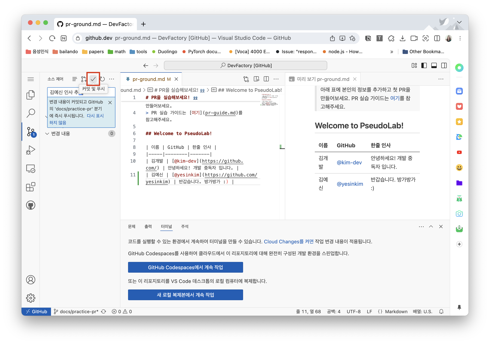

# PR 실습 가이드 🚀
아래의 가이드를 따라하면서 직접 PR을 올려보아요!

## 실습 가이드
> **NOTE** 위 가이드는 위 튜토리얼의 fork 과정을 거쳐 IDE 사용환경하에 있다는 전제하에 진행됩니다.

### 0. 미리보기 화면 세팅하기 (Optional)

`book/docs/ground.md` 파일을 열어 참여자 목록 테이블에 자신의 정보를 `markdown`으로 작성해주세요.
오른쪽 상단의 미리보기 버튼을 클릭하면 작성한 Markdown이 어떻게 보이는지 확인할 수 있습니다.




작업화면 오른편에 미리보기 화면이 생겼습니다!



### 1. 한줄 인사 작성하기
아래 양식을 참고해 작성해보세요!

```markdown
| 이름 | GitHub | 한줄 인사 |
|-----|--------|-------|
| 김개발 | [@kim-dev](https://github.com/) | 안녕하세요! 개발 중독자 입니다. |
```


### 2. 변경사항 추가하기

아래 처럼 변경사항을 작성했습니다.
1번을 눌러 코드 관리 툴에 접근해 2번 버튼으로 변경 사항을 추가해주세요.



### 4. 커밋 및 푸시하기



### 5. Pull Request 생성하기

GitHub에서 Pull Request를 생성합니다. PR 제목과 내용을 작성하고 'Create pull request' 버튼을 클릭합니다.


> **TIP** PR 제목은 명확하게, 내용은 상세하게 작성해주세요. 변경사항에 대한 설명과 함께 리뷰어가 이해하기 쉽도록 작성하면 좋습니다.

