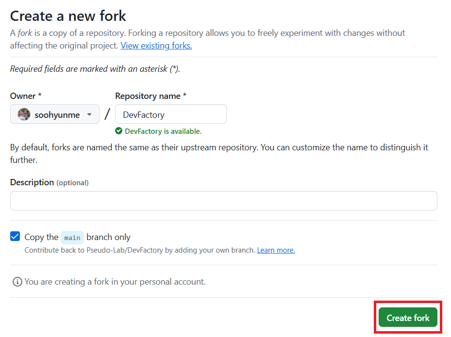
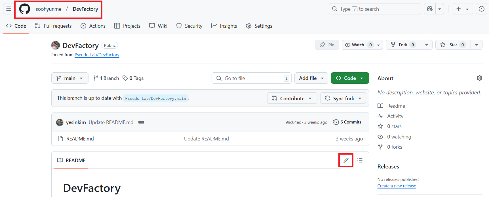
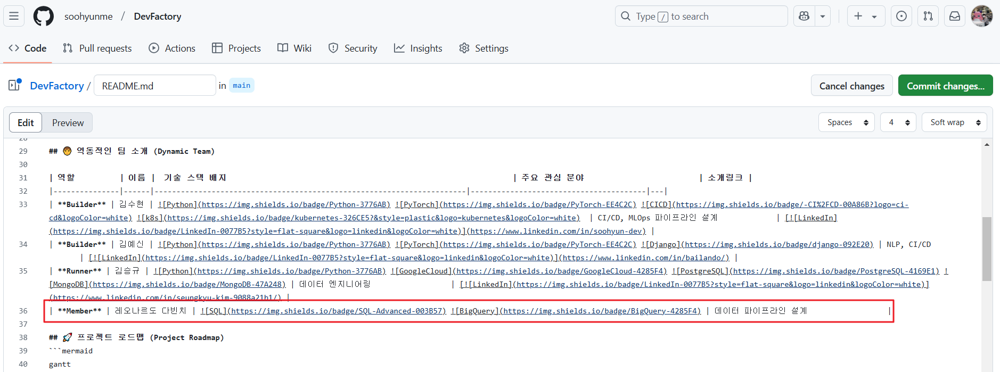
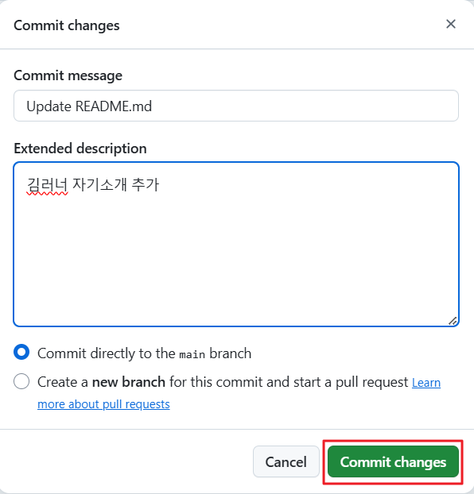
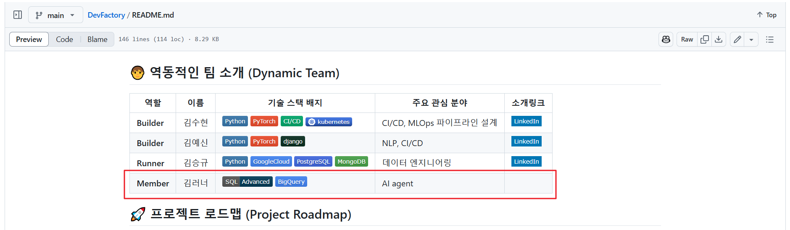
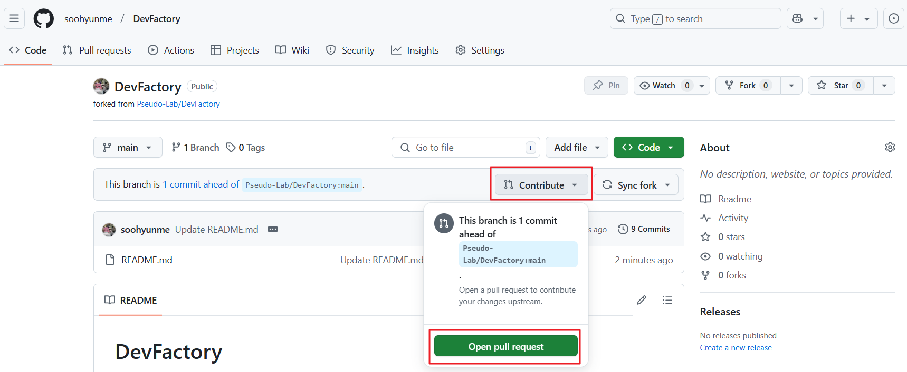
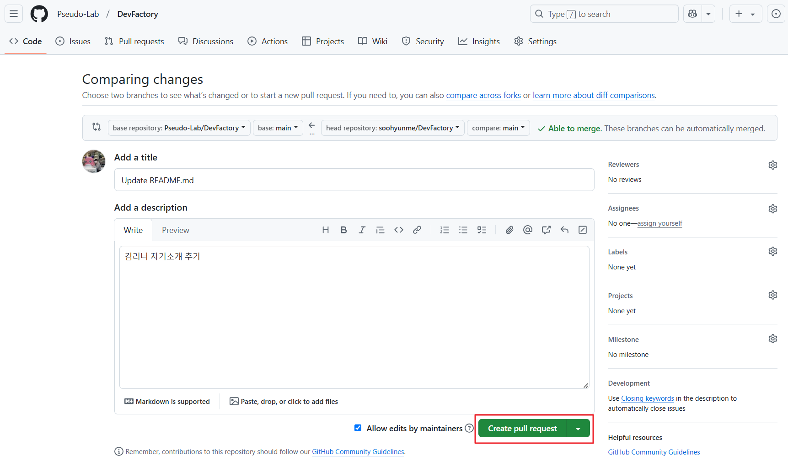
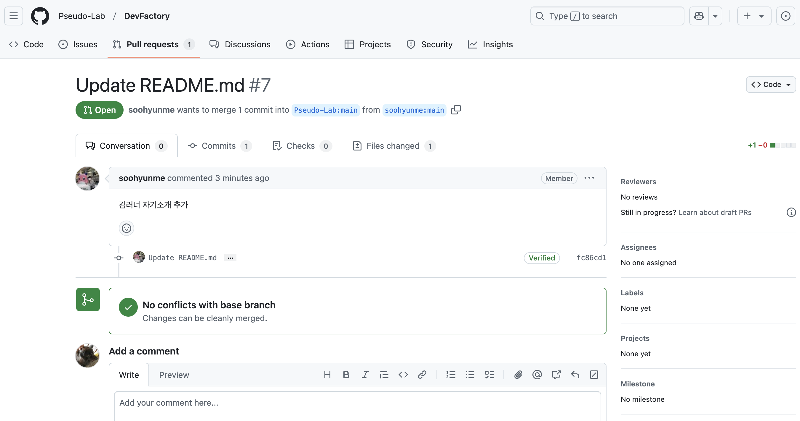

# 프로필 업데이트 하기 

## GitHub 풀 리퀘스트 가이드

## 1. 소개
**Pull Request(PR)**는 저장소에서 변경 사항을 제안하고 다른 사람들과 협업하는 방법입니다. PR을 통해 코드를 병합하기 전에 코드 검토를 받을 수 있습니다.
프로필을 업데이트하는 방법을 통해 Pull Request 사용법을 익혀보겠습니다.

## 2. 저장소 Fork
Git을 설치하지 않은 경우 다음 내용을 참고해서 설치하시면 됩니다.
<details>
<summary>Git 설치 및 config 설정 방법</summary>

### Git 설치
```sh
# Git 설치 (Linux)
sudo apt install git

# Git 설치 (MacOS)
brew install git

# Git 설치 (Windows)
# https://git-scm.com/ 에서 다운로드 후 설치
```

### Git 설정
```sh
git config --global user.name "Your Name"
git config --global user.email "your.email@example.com"
```
</details>

### 저장소 포크(Fork)
1. GitHub에서 저장소로 이동합니다.

2. 오른쪽 상단의 **Fork** 버튼을 클릭합니다.


3. **Create fork** 버튼을 클릭합니다.


## 3. 프로필 내용 추가하기
포크가 완료된 저장소에서 가장 상위에 있는 README.md 파일을 열고, 프로필 부분에 대한 부분을 찾습니다.
<br>
(포크가 완료된 저장소는 본인 Github repository에 존재합니다.)


프로필 코드 한줄을 복사하고 본인 프로필에 맞게 내용을 수정하시면 됩니다.


내용 변경 후 **Commit changes...** 버튼을 클릭합니다.


### Badge 만들기
새로운 Badge(Icon)을 생성하려면 다음 사이트를 참고해서 추가하시면 됩니다.
https://shields.io/ 

## 4. 변경 사항 스테이징 및 커밋 + 변경 사항을 GitHub에 푸시
다음처럼 commit 메시지와 description을 작성하고, **Commit changes** 버튼 클릭


커밋이 완료되면, Fork한 저장소에서 다음과 같이 내용이 업데이트 됩니다.


## 5. Pull Request 생성
현재 공용으로 사용하는 저장소에는 수정 사항이 반영되지 않았으므로 PR을 생성해야 합니다.
1. 같은 화면에서 다음과 같이 **Contribute** 버튼 클릭 -> **Open pull request** 버튼 클릭


2. 내용을 모두 작성한 뒤 **Create pull request** 버튼을 클릭합니다.


## 6. PR 리뷰 및 업데이트
다음과 같이 PR이 생성되면, 팀원들이 변경된 코드를 검토한 뒤 문제가 없을시 승인합니다.


## 7. Pull Request 병합
PR이 승인되면 다음 단계로 병합할 수 있습니다.
1. GitHub에서 **Merge Pull Request** 버튼 클릭.
2. 더 이상 필요하지 않은 경우 브랜치를 삭제합니다.

이제 프로필 업데이트가 완료되었습니다!
