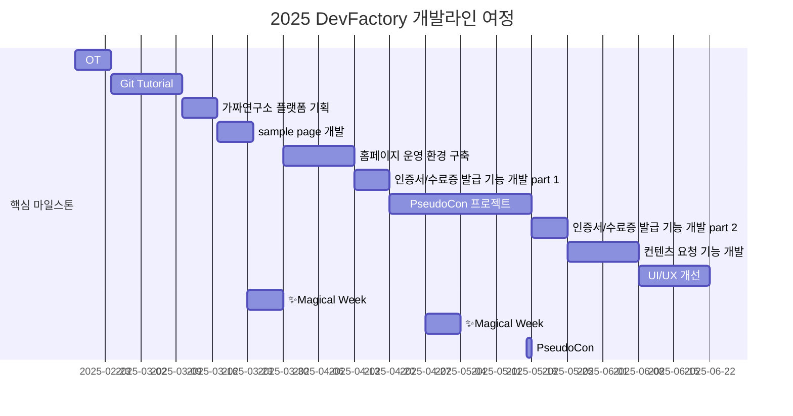

# DevFactory 10th

## 🌟 프로젝트 목표 (Project Vision)
_"가짜연구소의 개발 문화를 만들어가는 DevFactory"_  
- 신규 러너들의 Git 사용을 위한 Git Tutorial
- 수도콘 네트워킹 프로그램 개발
- 가짜연구소 수료증 발급 시스템 개발
- 가짜연구소 개발 문화를 위해 꾸준히 노력하기

## 🚀 프로젝트 로드맵 (Project Roadmap)

## 📈 성과 지표 (Achievement Metrics)
**10기 주요 KPI**  
| 지표             | 목표치  | 진행률      |
| -------------- | ---- | ----------- |
| 튜토리얼 및 데모 제작 수 | 3 개         | 3 개 (100%)  |
| 커밋 수               | 400 Commit   | 343 Commit (85.8%) |
| 플랫폼 방문수          | 200 회       | 186 회 (93%)  |

## 💻 주차별 활동 (Activity History)

| 날짜 | 내용 | 발표자 | 
| -------- | -------- |:----:|
| 2025/02/19 | OT | DevFactory |
| 2025/02/26 | Github Tutorial 기획 및 문서 작성 | DevFactory |
| 2025/03/05 | Github Tutorial 최종 수정 및 배포| DevFactory | 
| 2025/03/12 | 가짜연구소 플랫폼 기획 | DevFactory | 
| 2025/03/19 | Sample page 개발 | DevFactory | 
| 2025/03/26 | ✨1st Magical Week | - | 
| 2025/04/02 | 운영 환경 구축 및 코드 컨벤션 논의 | DevFactory | 
| 2025/04/09 | 코드 컨벤션 문서 작성 or 적용 | DevFactory | 
| 2025/04/16 | 인증서/수료증 발급 기능 개발 Part 1. | DevFactory |
| 2025/04/23 | PseudoCon 프로젝트 기획 및 개발 착수 | DevFactory | 
| 2025/04/30 | ✨2nd Magical Week | - | 
| 2025/05/07 | PseudoCon 프로젝트 개발 진행 | DevFactory | 
| 2025/05/14 | PseudoCon 프로젝트 테스트 | DevFactory | 
| 2025/05/17 | ✨PseudoCon | - | 
| 2025/05/21 | PseudoCon 프로젝트 회고 | DevFactory | 
| 2025/05/28 | 인증서/수료증 발급 기능 개발 Part 2. | DevFactory | 
| 2025/06/04 | 컨텐츠 요청 기능 개발 Part 1. | DevFactory | 
| 2025/06/11 | 컨텐츠 요청 기능 개발 Part 2. | DevFactory |
| 2025/06/18 | 가짜연구소 플랫폼 UI/UX 개선 Part 1. | DevFactory | 
| 2025/06/25 | 가짜연구소 플랫폼 UI/UX 개선 Part 2. | DevFactory | 
| 2025/07/02 | 10th DevFactory 마무리 회식 | DevFactory | 

## 💡 학습 자원 (Learning Resources)
**우리가 만든 지식 허브**  
- [Git tutorial](https://pseudo-lab.github.io/DevFactory/docs/github_intro.html)
- [Docker tutorial](https://pseudo-lab.github.io/DevFactory/docker_tutorial/00.docker_intro.html)
