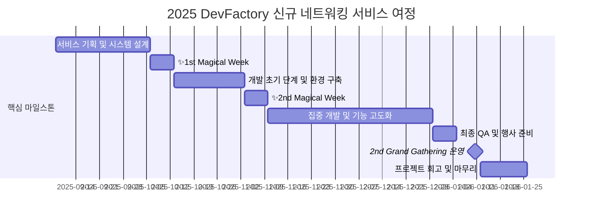

# DevFactory 11th

## 🌟 프로젝트 목표 (Project Vision)
_"가짜연구소의 개발 문화를 만들어가는 DevFactory"_  
- 2nd Grand Gathering에서 운영할 신규 네트워킹 서비스 기획/개발/운영
- 오프라인 행사 참여자 간 자연스러운 교류를 돕는 경험 설계
- 가짜연구소 수료증 발급 시스템 릴리즈
- DevFactory x JobPT 서비스 릴리즈

## 🚀 프로젝트 로드맵 (Project Roadmap)

## 💻 주차별 활동 (Activity History)

| 날짜 | 내용 | 발표자 |
| :--- | :--- | :---: |
| 2025/09/08 | OT & DevFactory 소개 | DevFactory |
| 2025/09/15 | 아이디어 브레인스토밍 | DevFactory |
| 2025/09/22 | 네트워킹 아이디어 구체화 & Bingo 기획 | DevFactory |
| 2025/09/29 | 시스템 설계 및 목표 수립 | DevFactory |
| 2025/10/06 | ✨1st Magical Week | - |
| 2025/10/13 | UI 공유 및 개발 목표 수립 | DevFactory |
| 2025/10/20 | 작업 내용 공유 및 개발 논의 | DevFactory |
| 2025/10/27 | FE-BE 초기 통신 환경 구축 및 작업 진행 | DevFactory |
| 2025/11/03 | ✨2nd Magical Week | - |
| 2025/11/10 | 사용자 인터랙션 질문 세트 구성 | DevFactory |
| 2025/11/17 | 운영 시나리오 수립 및 일정 마감 | DevFactory |
| 2025/11/24 | 핵심 기능 구현 및 상호 리뷰 | DevFactory |
| 2025/12/01 | 피드백 기반 UI/UX 세부 개선 | DevFactory |
| 2025/12/08 | 어드민 기능 기획 및 시스템 연동 | DevFactory |
| 2025/12/15 | 최종 안정화 및 예외 케이스 처리 | DevFactory |
| 2025/12/22 | 운영 환경 배포 및 최종 점검 | DevFactory |
| 2025/12/29 | 최종 QA 및 행사 준비 | DevFactory |
| 2026/01/10 | 2nd Grand Gathering - 네트워킹 서비스 운영 | DevFactory |
| 2026/01/12 | 11기 회고 (2nd GG 피드백) | DevFactory |
| 2026/01/27 | 마무리 회식 | DevFactory |

## 💡 학습 자원 (Learning Resources)
**우리가 만든 지식 허브**  
- [가짜연구소 수료증 발급 시스템](https://cert.pseudo-lab.com/)
- [친해지길바라](https://getcloser.pseudolab-devfactory.com/)
- [JobPT service](https://jobpt.pseudolab-devfactory.com/)