# 2nd Grand Gathering GetCloser Review

## 1. 프로젝트 개요

- **프로젝트명:** 친해지길바라 (GetCloser)
- **목적:** 오프라인 행사 참여자 간 심리적 거리 감소 및 네트워킹 활성화
- **운영 일시:** 2026.01.10 (2nd Grand Gathering)
- **운영 규모:** 행사 참여자 200명 이상

## 2. 설문 및 참여 현황

- **설문 응답:** 총 22명 (실제 서비스 이용자 11명, 미이용자 11명)
- **서비스 도달률:** 행사 시도자(147명) 대비 설문 참여 실사용자(11명) 기준, 약 7%의 심층 피드백 확보

## 3. 주요 지표 (Key Metrics)

- **서비스 전반 만족도:** ⭐ **4.27 / 5.0**
- **기존 방식(빙고) 대비 선호도:** **3.33 / 5.0**
- **재참여 의사:** **100% 긍정** (꼭 참여하고 싶다 72.5%, 상황에 따라 참여 27.3%)

## 4. 상세 분석 결과

### 4-1. 이번 네트워킹(친해지길바라)  참여 여부

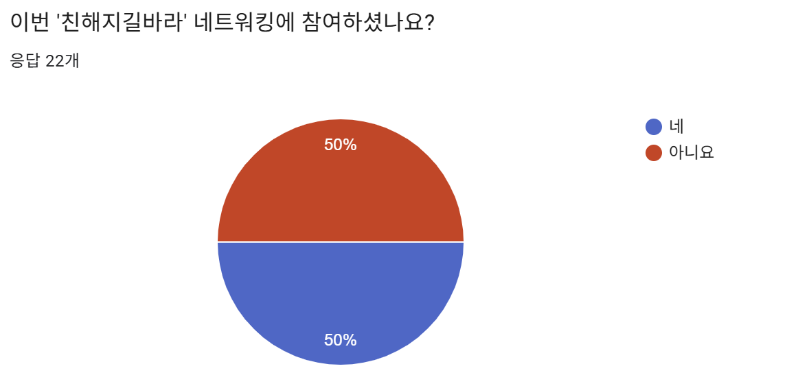

- 행사 내 총 147명이 서비스 이용을 시도하였으며, 그중 36명이 미션을 최종 성공
- 설문에는 실제 성공 인원 중 11명이 참여하여, 서비스 경험에 대한 심층적인 피드백 제공

### 4-2. 기존방식(빙고)과의 비교

**참여 여부**

- 이번 네트워킹 참여자 11명 중 54.5%(6명)가 이전 빙고 방식의 네트워킹을 경험해 본 것으로 확인됨.

**기존 빙고 네트워킹 비교**

- 평균 3.33/5.0점으로, 이번 서비스가 기존 방식보다 압도적으로 우수하다고 단정하기는 어려우나 새로운 방식에 대한 유의미한 피드백을 확보함.

**그렇게 느낀 이유**

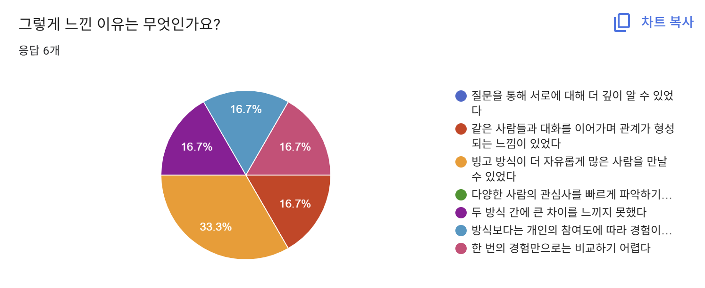

- "두 방식 간 큰 차이를 느끼지 못했다", "방식보다는 개인의 적극성에 따라 경험이 달라진다"는 중립적 의견이 존재함.
- 긍정적으로는 "특정 인원들과 대화를 이어가며 관계가 형성되는 느낌"을 았으나, "빙고 방식이 더 많은 사람을 자유롭게 만날 수 있었다"는 비교 의견도 있었음.

### 4-3. 서비스 전반 만족도

**서비스 자체 만족도**

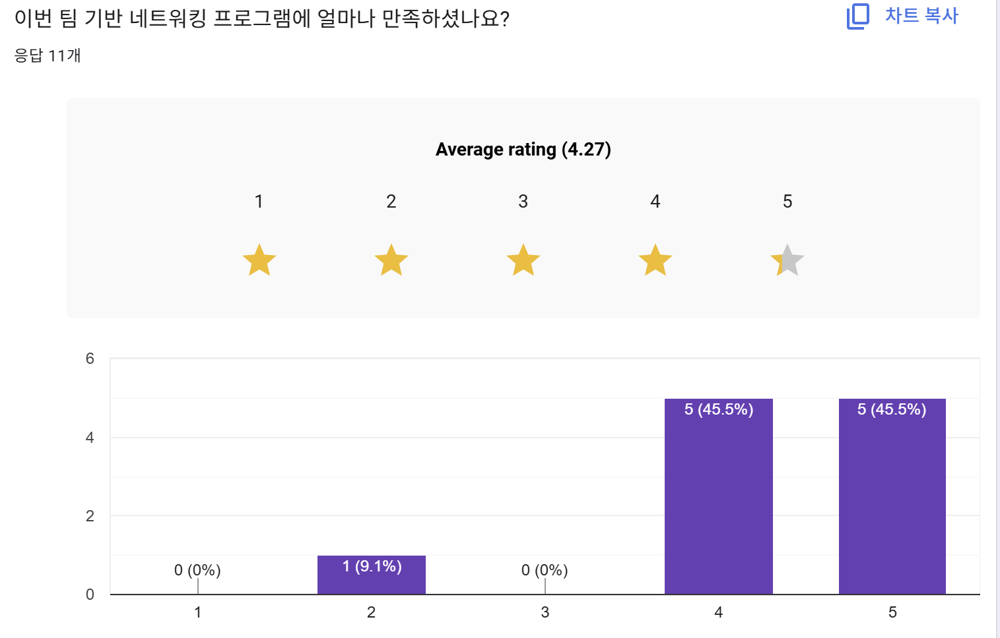

- 4.27점으로 전체적으로 높은 만족도를 기록함.

**적극적 참여도**

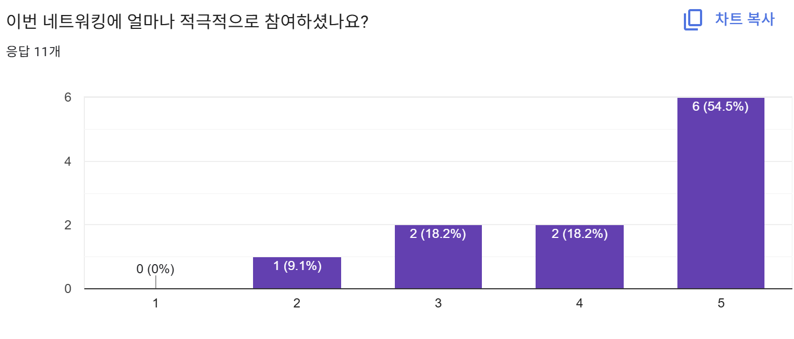

- 5점 만점 기준 5점(6명), 4점(2명)으로 대부분 매우 열정적으로 참여함.

**좋았던 점**

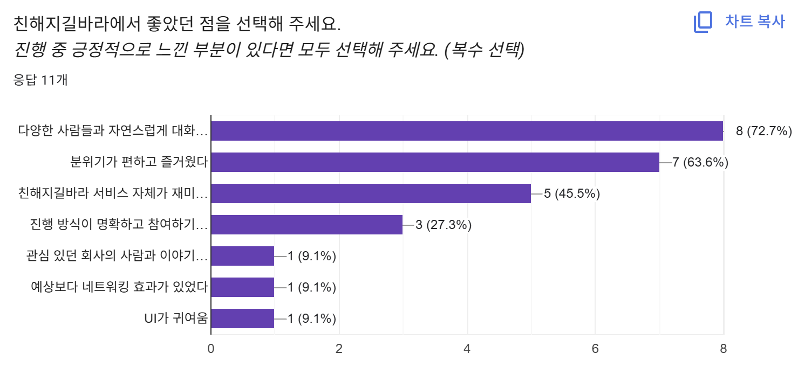

- "자연스럽게 대화할 수 있었다"는 의견이 8명으로 가장 많았음.
- 이어 분위기(7명), 서비스의 재미(5명), 명확한 진행 방식(3명) 순으로 긍정적인 평가가 이어짐.
- 기타: "관심 회사 사람과 대화 가능", "실질적인 네트워킹 효과", "귀여운 UI" 등의 개인 의견이 있었음.

**아쉬웠던 점**

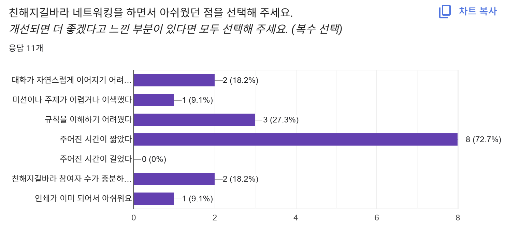

- "주어진 시간이 짧았다(8명)"는 의견이 가장 많아, 행사 내 시간 배분 개선이 시급함을 확인 함.
- 규칙 이해의 어려움(3명)이나 참여자 수 부족(2명) 등에 대한 피드백도 있었음.
- **운영 변수:** "명찰에 답이 이미 인쇄되어 있어 아쉬웠다"는 의견을 통해 운영진과 사전 조율 필요성을 확인

### 4-4. 서비스 내 질문 콘텐츠 만족도

**대화 도움 여부**

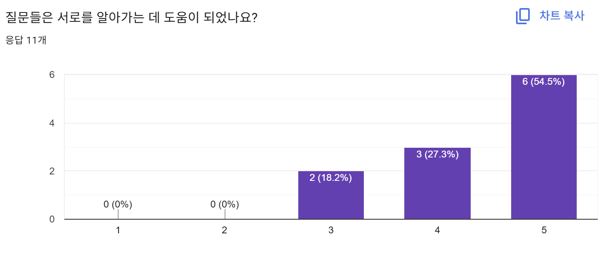

- 질문 콘텐츠가 서로를 알아가는 데 도움이 되었는지에 대해 5점(6명)을 포함해 전반적으로 높은 만족도를 보임. (MBTI, AI 관심사, 좋아하는 계절 등)

**질문의 난이도**

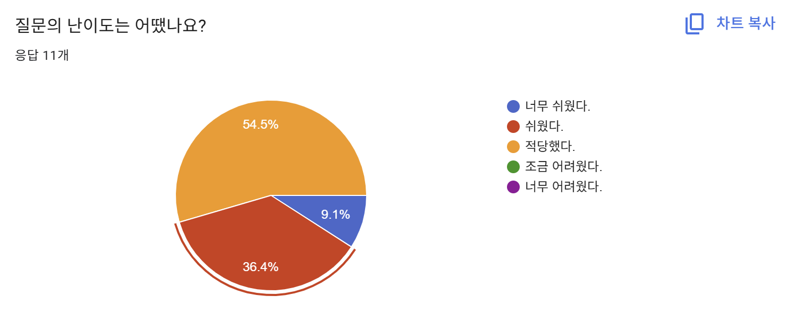

- 적당했다(54.5%), 쉬웠다(36.4%)는 의견이 주를 이룸. 명찰에 이미 답이 노출되어 변별력이 낮아진 점이 영향을 준 것으로 보임.

### 4-5. 서비스 내 팀 구성 만족

**팀 구성 만족도**

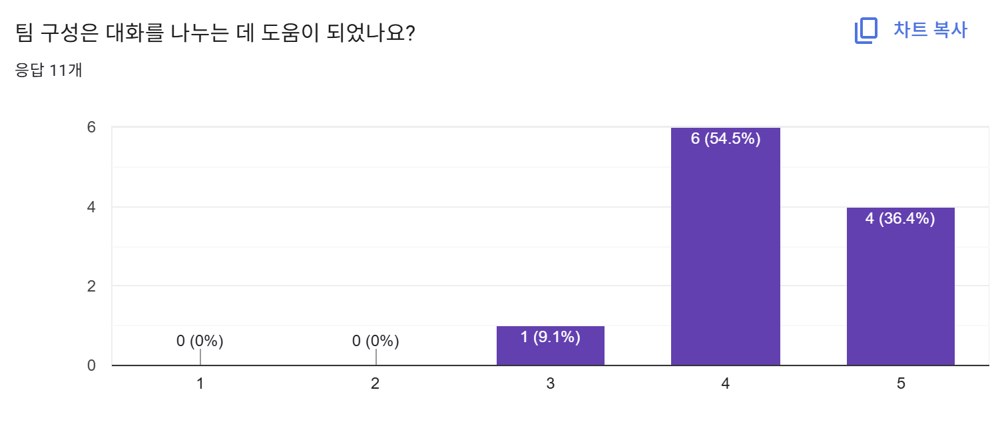

- 5점(4명), 4점(6명)으로 대화 환경을 조성하는 데 매우 긍정적인 역할을 함

**대화 활성도**

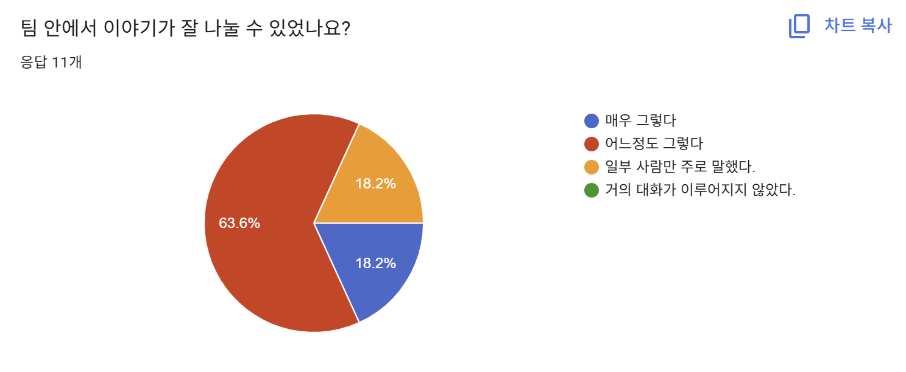

- 81.7%가 원활하게 이야기를 나누었으나, 18.2%는 "일부 사람 위주로 대화가 진행되었다"는 아쉬움을 표함.

**향후 참여 의사**

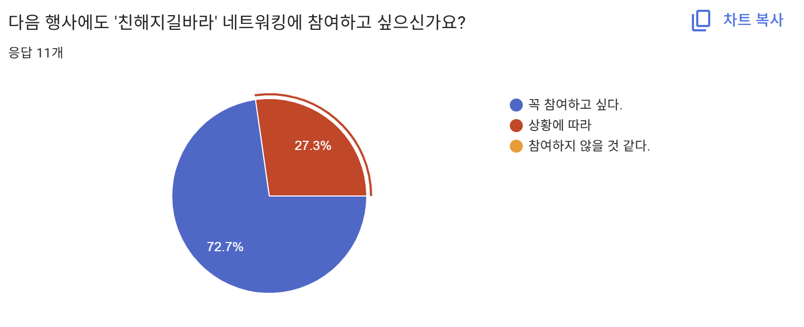

- **꼭 참여하고 싶다(72.5%)**, 상황에 따라 참여하겠다(27.3%)로 매우 긍정적인 재참여 의사를 확인 함.

### 4-6. 마무리 & 개선

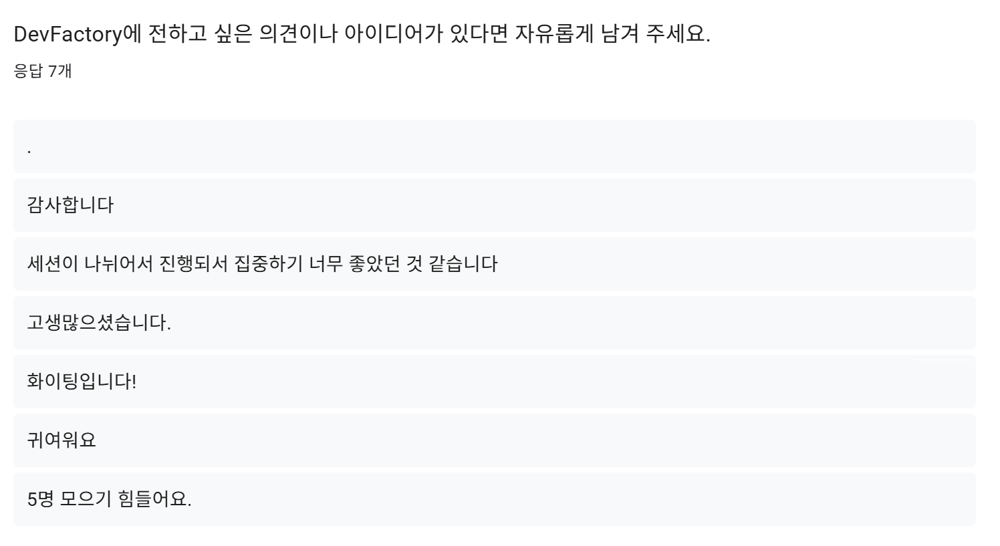

- 전반적으로 DevFactory에 대한 감사와 서비스의 긍정적인 면에 대한 의견이 많았음.
- 주관식에서도 "5명 모으기" 미션의 난이도가 높다는 의견이 반복된 만큼, 추후 인원 기준이나 미션 달성 방식을 개선할 필요가 있음.

## 5. 전체 리뷰

예상보다 개발 일정 지연과 행사장 확정이 늦어지면서 현장의 공간적 특성을 서비스에 충분히 반영하지 못한점이 아쉽다. . 특히 전체 참여 인원 대비 실제 미션 성공까지 이어진 비율이 낮았던 점은 행사장 배치나 운영 환경이 서비스 참여에 허들로 작용했음을 시사한다. 향후 운영 시에는 실제 참여자 비율을 고려하여 팀 구성 인원을 유연하게 조정할 수 있도록 함이 필요해보인다. 전반적으로 사용자들에게 긍정적인 평가를 받았으나, 이후 운영을 위해 개발 프로세스 효율화와 행사장의 물리적 특성을 고려한 서비스 개선의 필요성을 느꼈다.

## 6. 설문 개별 응답 보기

[설문 개별응답 연결](https://docs.google.com/spreadsheets/d/1wvRDBG1lrp8zL3geO_yi78qEMkYiIdALJEQAyuSkZn4/edit?usp=sharing)